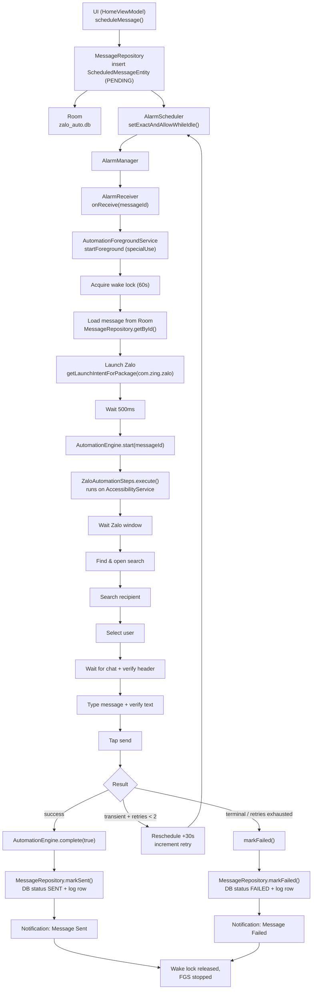

# System Architecture — Zalo Auto Sender

Single-module Android app that schedules messages and delivers them by driving Zalo's UI through an accessibility service. This document covers the runtime flow, package structure, and the role of every class.

## Runtime Flow



**Legend.** Solid path = normal send. `U → D` is the retry loop (max 2 retries, +30s). `BootReceiver` is a parallel path that re-registers pending alarms after reboot (messages > 5 min overdue are marked failed).

## Package Structure

```
com.example.zaloauto/
├── ZaloAutoApp.kt               # Application: builds DB + DataStore, creates notification channels
├── MainActivity.kt              # Single-activity Compose entry, bottom nav, hosts NavGraph
│
├── data/
│   ├── db/
│   │   ├── AppDatabase.kt       # Room DB ("zalo_auto.db"), version 1, 3 entities
│   │   ├── ScheduledMessageEntity.kt  # PENDING/SENT/FAILED/CANCELED
│   │   ├── MessageLogEntity.kt  # per-message attempt history (FK -> scheduled_messages)
│   │   ├── TemplateEntity.kt    # reusable message templates
│   │   ├── ScheduledMessageDao.kt
│   │   ├── MessageLogDao.kt
│   │   └── TemplateDao.kt
│   ├── repository/
│   │   ├── MessageRepository.kt # scheduling + status transitions + logging
│   │   └── TemplateRepository.kt
│   └── datastore/
│       └── UserPreferencesRepository.kt  # DataStore "settings" (auto_send flag)
│
├── service/
│   ├── AlarmScheduler.kt        # exact-alarm register/cancel (RTC_WAKEUP)
│   ├── AlarmReceiver.kt         # broadcast -> startForegroundService
│   ├── AutomationForegroundService.kt  # wake, launch, delegate, result, retry
│   ├── AutomationEngine.kt      # singleton bridge, concurrency guard
│   ├── BootReceiver.kt          # re-register alarms after reboot
│   └── accessibility/
│       ├── ZaloAutomationService.kt    # AccessibilityService (scoped to com.zing.zalo)
│       ├── ZaloAutomationSteps.kt      # step state machine + error categorization
│       ├── ZaloNodeFinder.kt           # node-tree traversal/search helpers
│       └── ZaloElementIds.kt           # Zalo-version -> element ID mapping
│
├── ui/
│   ├── ScreenWakeActivity.kt   # keyguard-dismiss activity (declared, not yet started)
│   ├── navigation/
│   │   ├── Routes.kt           # @Serializable route objects
│   │   └── NavGraph.kt         # NavHost wiring
│   ├── screens/
│   │   ├── home/               # HomeScreen, HomeViewModel (create + schedule)
│   │   ├── list/               # ListScreen, ListViewModel (history, cancel/delete)
│   │   ├── detail/             # DetailScreen, DetailViewModel (message + logs)
│   │   ├── templates/          # TemplatesScreen, TemplatesViewModel (CRUD)
│   │   └── settings/           # SettingsScreen, SettingsViewModel (permissions)
│   ├── components/             # StatusChip, PermissionStatusChip
│   └── theme/                  # ZaloAutoTheme
└── res/
    ├── xml/accessibility_config.xml   # service scope, events, flags
    └── values/                        # strings, themes
```

## Key Classes and Roles

### Entry point / application

| Class | Role |
|-------|------|
| `ZaloAutoApp` | `Application`. Lazily builds `AppDatabase` and `UserPreferencesRepository`; creates three notification channels (`channel_fgs`, `channel_task_status`, `channel_accessibility`). Exposes singleton `getInstance()`. |
| `MainActivity` | Compose host. Renders bottom `NavigationBar` (Home, History, Templates, Settings) and the `NavGraph`. |
| `ScreenWakeActivity` | Transparent activity that requests keyguard dismissal and screen-on. Declared in the manifest (`excludeFromRecents`, translucent theme) but **not currently started** by any code path — the FGS acquires a wake lock and checks the keyguard itself instead. |

### Scheduling (time-to-execution)

| Class | Role |
|-------|------|
| `AlarmScheduler` | Wraps `AlarmManager`. `scheduleMessage()` uses `setExactAndAllowWhileIdle` with `RTC_WAKEUP`; the `PendingIntent` uses the message ID as request code and a `zalo-auto://msg/<id>` data URI so it can be cancelled reliably. `cancelMessage()` uses `FLAG_NO_CREATE`. |
| `AlarmReceiver` | `BroadcastReceiver`. Reads `message_id` extra, forwards it to `AutomationForegroundService` via `ContextCompat.startForegroundService`. |
| `AutomationForegroundService` | The orchestration core. Sequence: start foreground notification → acquire `SCREEN_BRIGHT_WAKE_LOCK` (60s) → load message from Room → launch Zalo → 500ms settle → delegate to accessibility. Handles the completion callback: mark sent/failed, retry on transient, post result notification, release wake lock, stop self. |
| `BootReceiver` | After `BOOT_COMPLETED`, re-registers all `PENDING` alarms. Messages scheduled more than 5 minutes in the past are marked `FAILED` instead of firing. |
| `AutomationEngine` | Singleton coordination object. `start()` reserves the run and returns `false` if a run is already active (`@Volatile isBusy`). `complete()` fires the callback and releases the reservation. Bridges `AutomationForegroundService` and `ZaloAutomationService`. |

### Accessibility (UI automation)

| Class | Role |
|-------|------|
| `ZaloAutomationService` | `AccessibilityService` scoped to package `com.zing.zalo` (`accessibility_config.xml`). Sets `FLAG_REPORT_VIEW_IDS`. Exposes a singleton `instance` for cross-component access and an `automator` (`ZaloAutomationSteps`). |
| `ZaloAutomationSteps` | The send state machine. Runs on `Dispatchers.IO` with a 60s overall timeout. Steps: `WAITING_ZALO → FINDING_SEARCH → SEARCHING → SELECTING_USER → WAITING_CHAT → (verify header) → TYPING → SENDING → DONE`. Verifies text was actually set and the chat header matches the target before sending. Categorizes exceptions into `TRANSIENT` / `TERMINAL` via `categorizeError()`. |
| `ZaloNodeFinder` | Node-tree utilities: exact/partial text search, resource-ID search, first editable node, clickable-by-description, polling `waitForNode()`, retried `getRootSafely()`. Uses iterative stack traversal to avoid `StackOverflowError` on deep Zalo layouts, and recycles node references to avoid leaks. |
| `ZaloElementIds` | Maps Zalo `versionName` (major.minor) → UI element IDs (content descriptions + resource IDs). Falls back to the first known version if the installed version is unmapped. Currently keyed for Zalo 8.0. |

### Data layer

| Class | Role |
|-------|------|
| `AppDatabase` | Room DB `zalo_auto.db` with `scheduled_messages`, `message_logs`, `templates`. Version 1, schema exported. Debug builds allow destructive migration. |
| `ScheduledMessageEntity` | A scheduled send: target name, text, timestamp, status, optional template FK, retry count. |
| `MessageLogEntity` | Append-only attempt history per scheduled message (FK with `CASCADE`). |
| `TemplateEntity` | Reusable message template (name + content). |
| `ScheduledMessageDao` | Insert, status updates, `incrementRetry`, delete, get-by-id, flow of all / pending, suspend list of pending. |
| `MessageLogDao` | Insert + flow by scheduled message ID. |
| `TemplateDao` | Full CRUD + flows. |
| `MessageRepository` | Business facade for scheduling and status transitions. `scheduleMessage()` inserts; `markSent()`/`markFailed()`/`incrementRetry()` update the message AND append a `MessageLogEntity`. |
| `TemplateRepository` | CRUD facade over `TemplateDao`. |
| `UserPreferencesRepository` | DataStore `settings` preferences. Exposes the `auto_send` boolean as a `Flow`; `setAutoSend()` writes it. |

### UI state

ViewModels extend `AndroidViewModel`, expose a single immutable `*UiState` as `StateFlow`, and collect DAO flows with `viewModelScope`. They instantiate repositories directly from `ZaloAutoApp.getInstance().database` (no DI framework). Screens are stateless Composables that observe `uiState` and call ViewModel functions.

- `HomeViewModel` — validates + schedules a message, optionally applying a template; reports `canScheduleExactAlarms()`.
- `ListViewModel` — lists messages, cancels or deletes (cancel alarm first, then DB).
- `DetailViewModel` — loads a message and its log stream.
- `TemplatesViewModel` — CRUD for templates.
- `SettingsViewModel` — reads all four permission states and deep-links to system settings; toggles `autoSend`.

## Notable Design Decisions

- **No DI framework** — repositories are constructed directly from the app singleton; keeps the module simple.
- **Synchronized concurrency guard** — `AutomationEngine` prevents two automation runs from overlapping.
- **Version-tolerant UI selectors** — `ZaloElementIds` isolates element-ID drift; text-based selectors are the primary lookup with resource IDs as fallback.
- **Defensive node recycling** — every traversal path recycles `AccessibilityNodeInfo` to avoid memory pressure on long-running sessions.
- **Transient vs terminal errors** — the two-category retry policy prevents infinite retries while self-healing timeouts.
